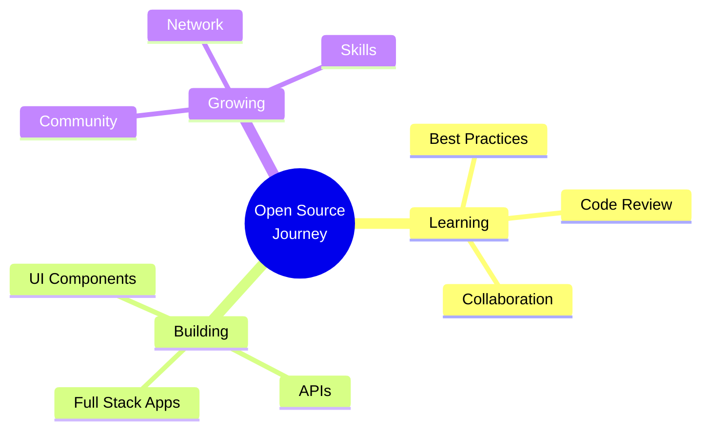

<div align="center">
  
# 👋 Hey there, I'm Kshitij!


[](https://yourportfolio.com)
[](www.linkedin.com/in/kshitij-bachhav-789a59213)
[](https://twitter.com/yourhandle)
[](mailto:kshitijbachhav005@gmail.com)


</div>

---

## 🚀 About Me

```javascript
const developer = {
    name: "Kshitij",
    role: "Aspiring Software Developer",
    passion: "Building solutions & contributing to open source",
    location: "India",
    currentFocus: "Software Development & Open Source Contributions",
    funFact: "I debug with console.log and I'm not ashamed! 🐛"
};
```

🌱 Currently diving deep into **open source contributions**  
💡 Always eager to learn new technologies and best practices  
🤝 Looking to collaborate on exciting open source projects  
⚡ Fun fact: Engineers still fix glitches on Voyager 1, rewriting code on a spacecraft with less memory than a calculator

---

## 🛠️ Tech Stack

<div align="center">

### 💻 Languages


### 🎨 Frontend


### ⚙️ Backend


### 🗄️ Databases


### ☁️ Services & Tools


</div>

---

## 📊 GitHub Stats

<div align="center">
  


</div>


---

## 🎯 Current Focus

<div align="center">



</div>

---


---

## 📫 Let's Connect!

<div align="center">

I'm always excited to collaborate on interesting projects or just have a chat about tech!


**Feel free to reach out:**

[](www.linkedin.com/in/kshitij-bachhav-789a59213)
[](mailto:kshitijbachhav005@gmail.com)


</div>

---

<div align="center">

### 💭 Random Dev Quote


---


**⭐ Star my repositories if you find them interesting!**

</div>
